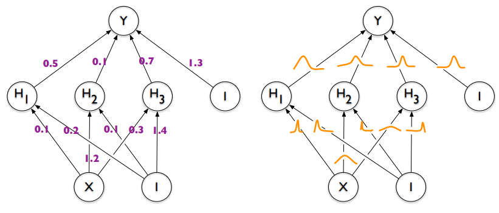
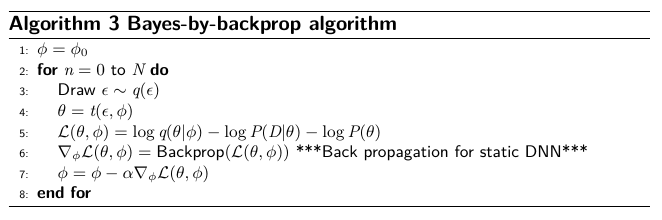

## Tutorial 4: Feature Selection and P-value Calculation

by *Suwichaya Suwanwimolkul, Ph.D.*

Support `Lecture 10: Bayesian Neural Network` ...

### 1. The difference between static neural network vs Bayesian neural network

  In this tutorial, we will build two neural networks: (1) static NN and (2) BNN 

  Each network has 2 linear layers with 1 activating function (sigmoid).
  We set the same learning rate and number of epoches to compare which model is better... 

  You can skip to each of the following topics...
  - [Install package](#installing-package)
  - [Import data](#import-data)
  - [Static neural network](#static-neural-network)
  - [Bayesian neural network](#bayesian-neural-network)   
      - [Gaussian object](#gaussian-object)
      - [Gaussian mixture for weight priors](#gaussian-mixture-for-weight-prior)
      - [Bayesian Linear Layer](#bayesian-linear-layer)
      - [Bayesian Linear Model](#bayesian-linear-model)
      - [Training BNN](#training-bnn)
  - [Learning performance](#learning-performance)
  - [Testing performance](#testing-performance)

  - Our implementation is based on [Nitarshan's Bayes-by-backprop](https://github.com/nitarshan/bayes-by-backprop) and 'Weight Uncertainty Neural Network' JMRL 2018. 

### 2. How to start constructing a Bayesian neural network using Pyro...

  In this tutorial, we will build a BNN with Pyro ...
 

  You can skip to each of the following topics...
  - [Install package](#installing-package)
  - [Import data](#import-data) 
  - [Bayesian neural network (Pyro)](#bayesian-neural-network-Pyro)    
  - [Training BNN](#training-bnn) 
  - [Prediction BNN](#prediction)

  Our implementation is based on [Pyro Stochastic Variational Inference](https://pyro.ai/examples/bayesian_regression.html#Bayesian-Regression-with-Pyro%E2%80%99s-Stochastic-Variational-Inference-(SVI)) 

 
 
###  3. Here is a fews things for you to know when developing BNN. 

- BNN can be extended from NN module of Pytorch. 
  
- The difference is the sampling process.  

  

- Don't forget that for BNN, you will need to sample the weights. 

  Therefore, you can use these layers to perform the same task and extended it for BNN.   

    

- Don't forget then when training BNN, the proceedure will be different:    

     